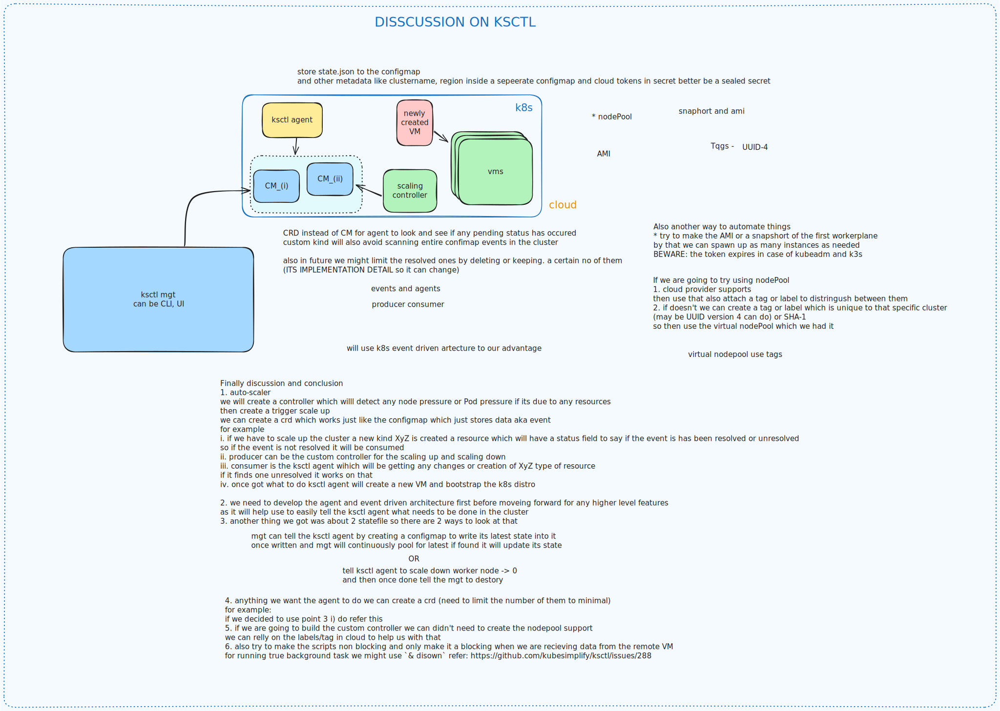

# ksctl events driven architecture using k8s operators

## Why are we building this?
ksctl aims to simplify the kubernetes cluster management
we are starting to provide support more advance features like cluster state, 
cluster health, production ready application stack, many more
for these we require close integration with the 
kubernetes api server what is the better place than controller manager Hooks

the domain is `ksctl.com`

## Components Planned
1. Ksctl agent (which will handle all the ksctl required logic like app install,
    loadbalancer service for external lb allocation)
2. Ksctl Storage
    gvr: `storage.ksctl.com/v1alpha1`
    kinds:
    - ImportState

3. Ksctl Application
    gvr: `application.ksctl.com/v1alpha1`
    kinds:
    - Stack

## check the design

## Things we need before going for the ksctl autoscaler
1. ksctl kubernetes storage driver
2. export and import of storage driver
3. create a storage import controller
4. ksctl agent to handle the request (logical part)
5. create an application stack controller for the applications to install

## AutoScaler design

Refer to this doc [Link](./design-autoscaler.md)

## Ksctl Component

Refer this [Link](./design-components.md)

## Ksctl Agent

Refer this [Link](./design-ksctl-agent.md)

