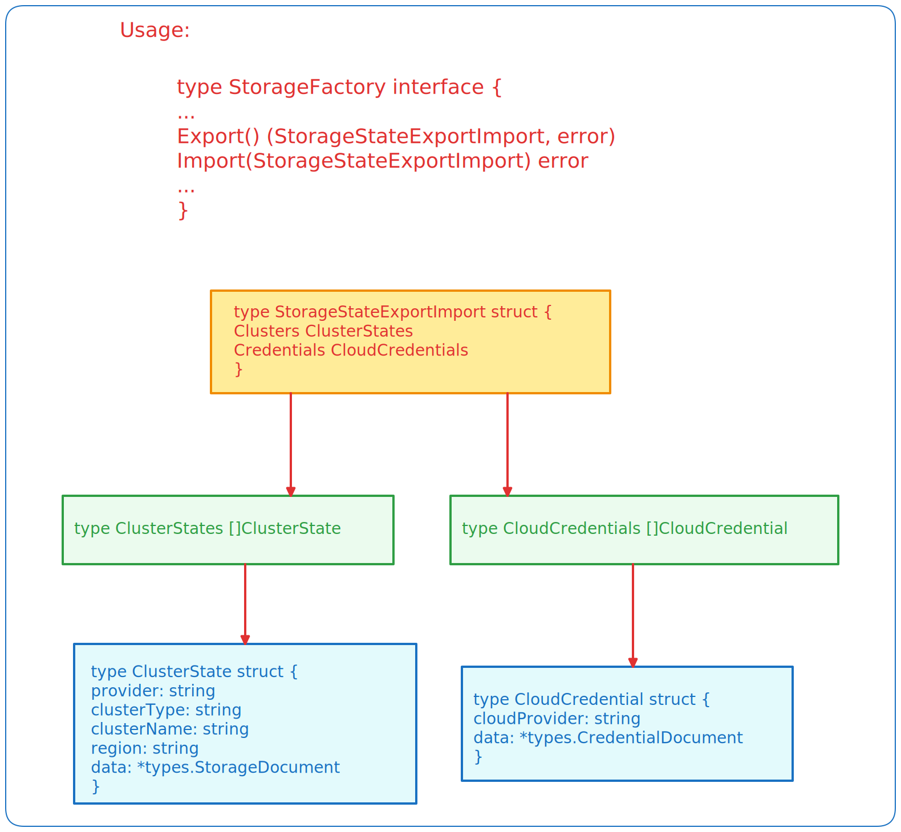
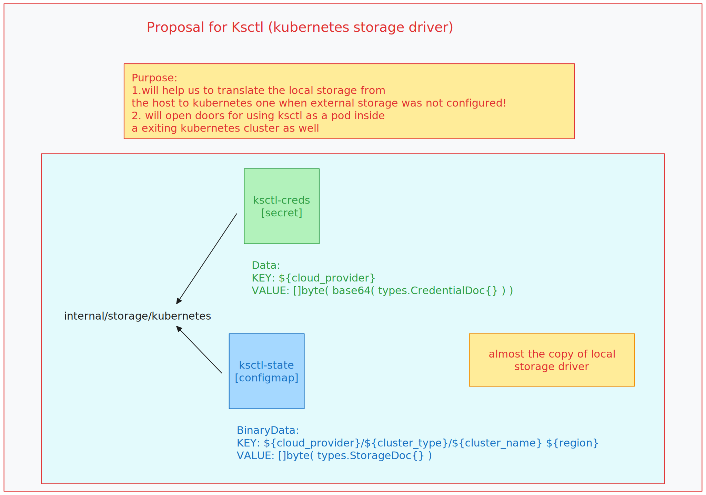

## Controllers & CRDs

### Application Stacks and Components

#### Application.Stacks()

apiVersion: `application.ksctl.com/v1alpha1`
kind: `Stack`

```yaml
spec:
  components:
  - name: !str ""
    version: !str ""
    type: !enum "app | cni"
```

### Storage Importer & Exporter

> [!NOTE]
> for now we are going to use this just for exporting the state files
> (given) the creation of the cluster took place from host local machine
> (constrains) it will not import when the storage falls under 
    **_external storage compatibility requirements_** (which are Mongodb)

#### StorageImporter
it will [Watch](#storageimport)
will create a ksctl agent rpc client to send the docuemnt to import in the kubernetes cluster

apiVersion: `storage.ksctl.com/v1alpha1`
kind: `ImportState`


```yaml
spec:
  rawData: !bytes ""
  Succeded: !bool false
```

it basically relies on storageDriver.Export and .Import methods

```py
if storage == "external.group":
  # we just need to extract the credentials
elif storage == "internal.group":
  # we need to perform storage.Export()
  # both the state and any cloud credentials which were used
```



> [!NOTE]
> For internal.group aka local:
> once these are done we can load them in the spec.rawData[]
> and apply the crd and the controller will load the ksctl agent client conn
> and the ksctl agent will perform storage.Import()


for this feature to work we also have to add another storage driver (kubernetes)



### LoadBalancer Provisioning

> [!NOTE]
> Work in Progress

### Cluster Autoscaler

> [!NOTE]
> Work in Progress

